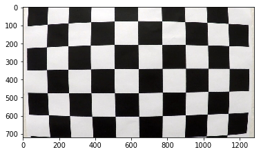

## Advanced Lane Finding Project

The goals / steps of this project are the following:

* Compute the camera calibration matrix and distortion coefficients given a set of chessboard images.
* Apply a distortion correction to raw images.
* Use color transforms, gradients, etc., to create a thresholded binary image.
* Apply a perspective transform to rectify binary image ("birds-eye view").
* Detect lane pixels and fit to find the lane boundary.
* Determine the curvature of the lane and vehicle position with respect to center.
* Warp the detected lane boundaries back onto the original image.
* Output visual display of the lane boundaries and numerical estimation of lane curvature and vehicle position.

## Perform camera calibration
The calbration images are read from the camera_cal folder, are transformed to grayscale and the chessboard corners are extracted from each image. If the corners are found correctly (ret == true), their coordinates are appended to the array imgpoints. At the same time the location of the undistorted chessboard corners is appended to the array objpoints. These are the same for each image. Once the data from all images is collected the function calibrateCamera is used to compute the camera matrix mtx (focal length and location of image center) and the distortion coefficients dist for the used camera. These coefficients can then be used to get undistorted camera images. Several images are required during the calibration process to make the optimization more robust.

Distorted Image            |  Undistorted Image
:-------------------------:|:-------------------------:
            |  

## Define image processing class
In the following the class "imgproc" is defined. It holds all functions that are used to process the images in the later sections of this project. These are the following:

* ini_tform: load camera specific information (transformation matrix, etc.) into class
* load image: load a new image into class
* undistort: use the camera coefficients to get an undistorted camera image
* ptransform: transform camera image into top-down view
* grayscale: convert to grayscale
* gaussian blur: apply gaussian blur filter
* canny: gradient based feature extraction
* region_of_interest: select region of interest from camera image
* hough: fit lines through the features detected with canny; this function includes a kalman filter that can be used to make the fit more robust by using information from previous frames (e.g. from a video).
* cg_thresh: image enhanmencement for better lane detection (used methods: gradient and hls transform)
* find_lanes_1: compute lane lines from enhanced image
* draw_lanes: overlay lane lines in original image frame
* col_test: test function for different image enhancement methods

## Compute perspective transform

First the lane lines are extracted from a test image by using functions from the class imgproc(); the image with the extracted lines is shown next:

The hough-lines information that was computed for lane line identification is then used to compute the corner coordinates of the trapezoid that shall be transformed to a rectangle with image coordinates ([[250,0],[1030,0],[1030,720],[250,720]]). The transformation matrix is then computed with the function "cv2.getPerspectiveTransform(src, dst)".

## Test perspective transform

The perspective transform is tested in the next cell with several test images. An indication that the transformation is correct is when the left and right lane lines appear to be fairly parallel in the transformed image. This seems to be the case here.

## Test thresholding

Next the thresholding function cg_thresh of the imgproc class is tested. This function does the following:

* compute a grayscale image from the undistorted original image and
    * compute the gradient in x-direction from this grayscale image (currently not used)
    * compute gradient magnitude and direction from the grayscale image gradients in x and y direction: mag = np.sqrt(np.square(sobelx)+np.square(sobely)); dirs = np.arctan2(abs_sobely, abs_sobelx)
    * image convolution with sobel kernel is used to compute the gradients (kernel size = 3)
    * apply thresholds to image gradient and magnitude
* compute a hls image from undistorted original image and
    * use "s"-channel from hls image with thresholds
* combine gradient magnitude, direction and hls image information into one enhanced image from which the lane lines can be extracted: combined[((mag_binary == 1) & (dir_binary == 1)) | (hls_binary == 1)] = 1

The effect of the cg_thresh() function can be seen below with gradient operations in the image in green and hls in blue.

In the following the thresholded test images are transformed into top-down view:

## Lane detection
### 1. With test images

Now the complete lane detection process can be tested with test images first. For lane detection the images have to be undistorted, thresholded and transformed first. Then the function find_lanes_1() from imgproc is applied. It has the following sections:

* at the beginning a histogram of the lower half of the image is computed. This histogram is then searched for the two prominent peaks which indicate the starting points of the left and right lane lines. The search is performed between 150 and 400 pixels for the left lane and between 1000 and 1200 pixels for the right lane line.
* Beginning from these starting points the image is searched from bottom to top with 9 search windows that each have a height of 720/9 = 80 pixels and a width of 200 pixels.
* If more than 100 pixels are detected within a search window, the starting point for the next search window is computed as the (integer) mean of the pixel x positions from the previous search window.
* Next, a 2nd order polynomial is fitted through the pixel positions that were identified by the search: self.current_fit[0] = np.polyfit(lefty x self.ym_per_pix, leftx x self.xm_per_pix, 2),... The parameters x,y_m_per_pix are used for transformation from pixels to SI units. 
* This is helpful for the computation of the curvature radius of the lane lines and the distance of the car from the center between the lane lines.
* In the following some plausibility checks are performed on the results of the lane line identification:
    * the difference in curvature radius of the lane lines shall be smaller than 500m
    * the starting points for the lane lines at image bottom shall be between 150 and 400 pixels for the left lane and between 1000 and 1200 pixels for the right lane line.
    * the curvature radius shall be greater than 300m for both lane lines
    * if this is the case the lane detection result is used for the drawing of the lane lines (self.detected=True) and an error counter self.ecnt is reduced by 1.
    * if not the result is not used and the error counter is increased
    * if the result is admitted, it is stored in a buffer list "self.fit_list_l,r" which is used to compute the mean of the last five admissible lane detection results: self.best_fit=np.concatenate((self.fit_list_l.sum(axis=0)/5,self.fit_list_r.sum(axis=0)/5),axis=0)
    * if the error counter reaches 5 the lane identification with the window search is triggered again (self.reaquire=True); if this is not the case - and after the initial lane detection has been performed once - it is sufficient for the analysis of the next image in the pipeline to use the previously computed polynomial function and to search in an evironment of +/-100pixels around this polynomial function

The lines are then drawn with the function draw_lanes():

* First the lane lines are computed for the top-down view with the polynomial coefficients self.best_fit... from the find_lanes_1 function. Then they are transformed into camera view by inverse transformation with self.Minv and merged with the original camera image.
* Also displayed are the enhanced image for lane identification, the top down view and some additional information (radius of curvature, etc).
The result from the process is shown in the following image:

The process with videos is then the same as described above for test images.
